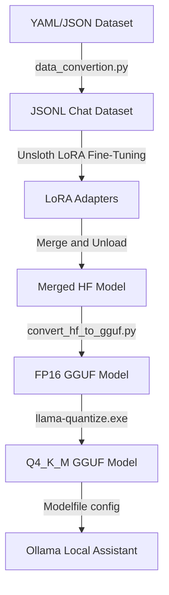

# 🤖 HR DB Assistant: Natural Language to SQL (NL2SQL) Converter

A comprehensive pipeline for fine-tuning a small language model (**Llama-3.2-1B-Instruct**) on natural language HR payroll and attendance questions, converting them to optimized MySQL queries, quantizing the model, and running it locally using **Ollama**.

---

## 📋 Table of Contents
1. [Overview](#-overview)
2. [Database Schema](#-database-schema)
3. [Project Directory Structure](#-project-directory-structure)
4. [Execution & Deployment Pipeline](#-execution--deployment-pipeline)
   - [Step 1: Data Preprocessing](#step-1-data-preprocessing)
   - [Step 2: Model Fine-Tuning (LoRA)](#step-2-model-fine-tuning-lora)
   - [Step 3: GGUF Conversion & Quantization](#step-3-gguf-conversion--quantization)
   - [Step 4: Local Deployment with Ollama](#step-4-local-deployment-with-ollama)
5. [Inference Configuration](#-inference-configuration)
6. [Sample Training Queries](#-sample-training-queries)

---

## 🔍 Overview

The **HR DB Assistant** is designed to simplify HR databases interactions. Instead of writing complex SQL queries manually, non-technical users or downstream applications can query attendance, payroll, and employee records using plain English (e.g., *"How many days was John Doe absent this month?"*).

### Key Features
- **Fast Fine-tuning:** Utilizes **Unsloth** (2x faster LoRA fine-tuning) on Llama-3.2-1B-Instruct.
- **Edge Deployment:** Quantized down to `Q4_K_M` GGUF format for ultra-fast, CPU-friendly execution.
- **Strict Guardrails:** Configured via Ollama `Modelfile` to output *only* valid SQL, preventing explanation text, paraphrasing, or hallucinated database columns.

---

## 🗄️ Database Schema

The assistant is trained specifically to translate questions into queries for a relational database with three tables. The full schema structure is detailed in [Database schema.txt](file:///c:/Posting/HR%20DB%20Assistant/Database%20schema.txt):

```sql
-- Employee details and status
employees(
  emp_id,
  name,
  department,
  role,
  salary,
  joining_date,
  status        -- 'Active' / 'Inactive' etc.
)

-- Daily attendance tracking
attendance(
  emp_id,
  date,
  status,        -- 'Present' / 'Absent' / 'Leave'
  hours_worked
)

-- Monthly payroll details
payroll(
  emp_id,
  month,
  year,
  gross_salary,
  deductions,	
  net_salary
)
```

---

## 📂 Project Directory Structure

Here is an overview of the key files in this project:

- 📊 **Dataset Files:**
  - [Training SQL data.yaml](file:///c:/Posting/HR%20DB%20Assistant/Training%20SQL%20data.yaml): The original curated dataset containing natural language queries and their equivalent MySQL statements.
  - [training_data.json](file:///c:/Posting/HR%20DB%20Assistant/training_data.json): JSON version of the training dataset.
  - [hr_dataset_train.jsonl](file:///c:/Posting/HR%20DB%20Assistant/hr_dataset_train.jsonl): The formatted JSONL dataset featuring ChatML structure (`system`, `user`, `assistant` messages) processed for training.

- ⚙️ **Preprocessing & Configuration Scripts:**
  - [data_convertion.py](file:///c:/Posting/HR%20DB%20Assistant/data_convertion.py): Python script that parses `training_data.json` and writes `hr_dataset_train.jsonl` for training.
  - [Database schema.txt](file:///c:/Posting/HR%20DB%20Assistant/Database%20schema.txt): Raw description of database schema and default assistant prompt guidelines.
  - [Model Adaption.txt](file:///c:/Posting/HR%20DB%20Assistant/Model%20Adaption.txt): Outline instructions describing conversion of model checkpoints using `llama.cpp` tools.
  - [Modelfile](file:///c:/Posting/HR%20DB%20Assistant/Modelfile): Configuration file defining the local Ollama system prompt, generation rules, and parameters.

- 🤖 **Model Pipeline & Outputs:**
  - [NL_to_SQL_Converter.ipynb](file:///c:/Posting/HR%20DB%20Assistant/NL_to_SQL_Converter.ipynb): Jupyter Notebook carrying out the complete model setup, training, merging, and download cycle.
  - [hr_sql.Q4_K_M.gguf](file:///c:/Posting/HR%20DB%20Assistant/hr_sql.Q4_K_M.gguf): Fully quantized local model (Q4_K_M) ready for execution.
  - [hr_sql1.Q4_K_M.gguf](file:///c:/Posting/HR%20DB%20Assistant/hr_sql1.Q4_K_M.gguf): Additional quantized GGUF weight iteration.

---

## 🚀 Execution & Deployment Pipeline



### Step 1: Data Preprocessing
Before starting model training, convert the curated JSON samples into standard training-ready JSONL containing conversational message structures. 

Run the [data_convertion.py](file:///c:/Posting/HR%20DB%20Assistant/data_convertion.py) script:
```bash
python data_convertion.py
```
This loads [training_data.json](file:///c:/Posting/HR%20DB%20Assistant/training_data.json) and formats it into [hr_dataset_train.jsonl](file:///c:/Posting/HR%20DB%20Assistant/hr_dataset_train.jsonl) containing:
```json
{
  "messages": [
    {"role": "system", "content": "You are an HR SQL assistant..."},
    {"role": "user", "content": "Show all employees"},
    {"role": "assistant", "content": "SELECT * FROM employees;"}
  ]
}
```

### Step 2: Model Fine-Tuning (LoRA)
Open the Jupyter Notebook [NL_to_SQL_Converter.ipynb](file:///c:/Posting/HR%20DB%20Assistant/NL_to_SQL_Converter.ipynb) on a GPU instance (e.g., Google Colab T4).

The training runs using **Unsloth** and Hugging Face's **TRL**:
1. **Model & Tokenizer Initialization:** Loads 4-bit quantized `unsloth/Llama-3.2-1B-Instruct-bnb-4bit`.
2. **LoRA Configuration:**
   - Rank ($r$) = `64`
   - Scaling factor ($\alpha$) = `128`
   - Target Modules = `["q_proj", "k_proj", "v_proj", "o_proj", "gate_proj", "up_proj", "down_proj"]`
3. **Training Parameters:**
   - Epochs = `3`
   - Learning Rate = `2e-4`
   - Batch size per device = `1` (Gradient accumulation steps = `2`)
   - Optimizer = `adamw_8bit`
4. **Adapter Merging & Export:**
   Merges PEFT adapters back into full precision model weights using `model.merge_and_unload()` and exports the model directory to `hr_sql_merged`.

### Step 3: GGUF Conversion & Quantization
Once you download the merged model folder `hr_sql_merged`, use `llama.cpp` scripts to compile it into GGUF format.

1. **Clone `llama.cpp`:**
   ```bash
   git clone https://github.com/ggerganov/llama.cpp
   cd llama.cpp
   ```
2. **Convert HF weights to FP16 GGUF:**
   ```bash
   python convert_hf_to_gguf.py C:\Path\To\Downloads\hr_sql_merged --outfile hr_sql.fp16.gguf --outtype f16
   ```
3. **Quantize to 4-bit (Q4_K_M):**
   ```bash
   llama-quantize.exe hr_sql.fp16.gguf hr_sql.Q4_K_M.gguf Q4_K_M
   ```
4. Copy `hr_sql.Q4_K_M.gguf` back to your main project workspace.

### Step 4: Local Deployment with Ollama
Ollama is used to host the quantized GGUF model locally.

1. Create a [Modelfile](file:///c:/Posting/HR%20DB%20Assistant/Modelfile) in the same directory as the GGUF model:
   ```dockerfile
   FROM ./hr_sql.Q4_K_M.gguf

   SYSTEM """You are an HR SQL assistant.
   You must convert the user's question into a valid MySQL SQL query.
   Use ONLY the following tables and columns:

   employees(emp_id, name, department, role, salary, joining_date, status)
   attendance(emp_id, date, status, hours_worked)
   payroll(emp_id, month, year, gross_salary, deductions, net_salary)

   Rules:
   - Output ONLY SQL
   - Do NOT explain
   - Do NOT paraphrase
   - Do NOT add text
   - Do NOT invent columns
   - If unsure, still output the closest valid SQL"""

   TEMPLATE {{ .Prompt }}

   PARAMETER temperature 0
   PARAMETER top_p 1
   PARAMETER repeat_penalty 1.1
   ```
2. **Build the local Ollama model:**
   ```bash
   ollama create hr_sql -f "Modelfile"
   ```
3. **Run the assistant:**
   ```bash
   ollama run hr_sql
   ```

---

## ⚙️ Inference Configuration

For SQL generation, precision is paramount. The configuration defaults are set to ensure deterministic and exact outcomes:

- `temperature = 0`: Ensures the model outputs the most likely token (deterministic generation), preventing creative formatting or alternative queries.
- `top_p = 1`: Standard value when sampling is disabled.
- `repeat_penalty = 1.1`: Avoids loop-generation failures while outputting nested commands.

---

## 💡 Sample Training Queries

The model translates the following patterns successfully:

| Natural Language Question | Generated SQL Output |
| :--- | :--- |
| *Show all employees* | `SELECT * FROM employees;` |
| *What is the average salary of employees?* | `SELECT AVG(salary) FROM employees;` |
| *Show employees who took leave more than 5 days* | `SELECT e.name, COUNT(*) AS leave_days FROM attendance a JOIN employees e ON a.emp_id = e.emp_id WHERE a.status = 'Leave' GROUP BY e.name HAVING leave_days > 5;` |
| *Show total payroll cost per department for 2024* | `SELECT e.department, SUM(p.net_salary) AS total_payroll FROM payroll p JOIN employees e ON p.emp_id = e.emp_id WHERE p.year = 2024 GROUP BY e.department;` |
